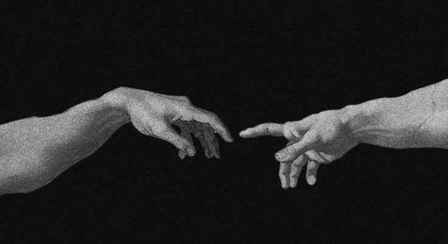

# Hey there, I'm Bavajithu!

I love building things that are complex and make sense. As you might be able to tell, I am a Linux enthusiast.

### Programming Stack:

### Programming Stack:

- C++ (Primary)
- x86 Assembly (for OS project)
- Game engine in pure C++

### Statistics:

### Contributions:

