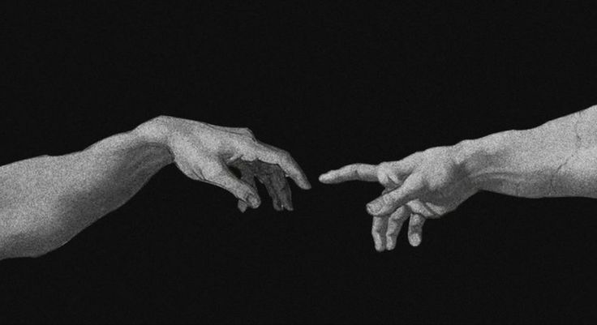

<h1 align="center">Hello, I'm Bavajithu</h1>

I build systems and low-level software. Linux, C, and complexity with purpose.

---

Systems Programming student interested in:

- Operating Systems
- Graphics Programming
- Game engine architecture
- Low-level optimization

## Current Focus:

- x86 OS development
- Vulkan renderer
- Low-level concepts utilizing C and C++.

---

## Contacts:

- Email: systems.loris@gmail.com
